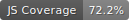

# Dashboard Engine
[](https://github.com/gregLibert/dashboard-generator/actions/workflows/ci.yml)
[](coverage.svg)
[](https://github.com/gregLibert/dashboard-generator/actions)

A Simple Static Dashboard Generator

## 1. Objective

This project is a lightweight, serverless dashboard engine designed to generate **standalone HTML reports**. It is particularly useful in data pipelines (Dataiku DSS, Airflow, ETL scripts) where the output needs to be a portable, interactive file without requiring a dedicated web server (Node/Flask/Django).

**Key Features:**

* **Zero-Dependency Output:** Generates a single `.html` file containing all CSS, JS (D3.js), and Data.
* **Interactive:** Widgets support zooming, filtering (Year/Period), and tooltips.
* **Python 2.7 & 3.x Compatible:** optimized for legacy enterprise environments.
* **Data Observability:** Built-in support for data source descriptions and documentation.

## 2. Widget Configuration

The dashboard is defined by a JSON configuration dictionary. Below are the available widgets and their specific settings.

### Common Fields (All Widgets)

| Field | Type | Description |
| --- | --- | --- |
| `type` | String | The widget ID (e.g., `sankey`, `sunburst`). |
| `title` | String | The header title of the chart card. |
| `description` | Markdown String | *(Optional)* Contextual info, source details, or filter rules displayed via an info icon. |
| `datasetIndex` | Integer | The index of the CSV string passed to the generator (0, 1, 2...). |

---

### A. Sankey Diagram (`sankey`)

Standard flow visualization for source-to-destination logic.
```json
{
  "type": "sankey",
  "title": "Flow Analysis",
  "datasetIndex": 0,
  "mapping": {
    "date": "month_year",  // Column for time filtering
    "path": ["<col1>", "<col2>", "<col3>"],    // Column for node ordering
    "value": "count"       // Column for link width
  }
}
```

### B. Financial Sankey (`financial_sankey`)

Specialized Sankey for Income Statements (Waterfall logic). Colors are auto-assigned based on the `type` column in the data.

**Data Requirements:** The CSV must contain a `type` column with values: `input` (Grey), `profit` (Green), or `cost` (Red).

```json
{
  "type": "financial_sankey",
  "title": "P&L Statement",
  "datasetIndex": 1,
  "mapping": {
    "date": "date_col",
    "source": "source_node",
    "target": "target_node",
    "value": "amount",
    "type": "category_type" // Must contain 'input', 'cost', or 'profit'
  }
}
```

### C. Sunburst (`sunburst`)

Zoomable hierarchical pie chart. Supports Logarithmic scale for disparate data volumes.

```json
{
  "type": "sunburst",
  "title": "Portfolio Composition",
  "datasetIndex": 2,
  "mapping": {
    "date": "date_col",
    "value": "amount",
    "hierarchy": ["Level1", "Level2", "Level3"] // Array of columns defining depth
  },
  "options": {
    "useLogScale": true // If true, displays a 'LOG' badge and scales arcs logarithmically
  }
}

```

### D. Evolution Chart (`evolution`)

Time-series chart with comparison features.

```json
{
  "type": "evolution",
  "title": "Monthly Trend",
  "datasetIndex": 0,
  "mapping": {
    "date": "date_col",
    "value": "metric",
  }
}

```

### E. Horizon Chart (`horizon`)

Ridgeline/Horizon chart for high-density time-series analysis (e.g., server load by hour).

```json
{
  "type": "horizon",
  "title": "Server Load Profile",
  "datasetIndex": 3,
  "mapping": {
    "x": "hour_col",      // Numeric (0-23)
    "y": "group_col",     // Category (e.g., "Monday", "Server A")
    "value": "load_metric"
  },
  "options": {
    "bands": 4,           // Number of color layers
    "height": 50,         // Height of each row in px
    "color": "#d32f2f",   // Base color (Hex)
    "xAxisMode": "linear" // "linear" (simple numbers) or "weekly" (adds grid lines)
  }
}

```

## 3. Usage (Python 2.7 Pseudo-Code)

Ensure the `dashboard_engine` folder is in your python path.

```python
# -*- coding: utf-8 -*-
import sys
import os
import io

# 1. Import Generator
# Assuming the package is in the current directory
sys.path.append(os.getcwd()) 
from dashboard_engine.generator import DashboardGenerator

# 2. Prepare Data (Strings in CSV format)
# In production, you would read these from files or database results
csv_data_main = """date,scheme,amount
2025-01,Discover,1000
2025-01,CB,2000
2025-02,Discover,1500
2025-02,CB,2200"""

csv_data_finance = """date,source,target,amount,type
2025-01,Sales,Revenue,5000,input
2025-01,Revenue,Cost,2000,cost
2025-01,Revenue,Profit,3000,profit"""

# 3. Configure Dashboard
config = {
    "title": "Executive Report 2025",
    "subtitle": "Generated via Python 2 ETL",
    "widgets": [
        {
            "type": "evolution",
            "title": "Global Trends",
            "datasetIndex": 0, # Points to csv_data_main
            "mapping": {
                "date": "date",
                "value": "amount",
                "category": "scheme"
            }
        },
        {
            "type": "financial_sankey",
            "title": "Profit & Loss Flow",
            "datasetIndex": 1, # Points to csv_data_finance
            "description": "<strong>Source:</strong> SAP Extract<br><strong>Scope:</strong> Q1 2025",
            "mapping": {
                "date": "date",
                "source": "source",
                "target": "target",
                "value": "amount",
                "type": "type"
            }
        }
    ]
}

# 4. Generate Output
try:
    generator = DashboardGenerator()
    
    # Pass config and list of CSV datasets
    html_output = generator.generate(config, [csv_data_main, csv_data_finance])
    
    # Write to file (Use io.open for utf-8 support in Py2)
    output_path = "dashboard_output.html"
    with io.open(output_path, "w", encoding="utf-8") as f:
        f.write(html_output)
        
    print "Success! Dashboard generated at: " + output_path

except Exception as e:
    print "Error generating dashboard:", e

```