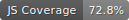

# Dashboard Engine
[](https://github.com/gregLibert/dashboard-generator/actions/workflows/ci.yml)
[](coverage.svg)
[](https://github.com/gregLibert/dashboard-generator/actions)

A Simple Static Dashboard Generator

## 1. Objective

This project is a lightweight, serverless dashboard engine designed to generate **standalone HTML reports**. It is particularly useful in data pipelines (Dataiku DSS, Airflow, ETL scripts) where the output needs to be a portable, interactive file without requiring a dedicated web server (Node/Flask/Django).

**Key Features:**

* **Zero-Dependency Output:** Generates a single `.html` file containing all CSS, JS (D3.js), and Data.
* **Interactive:** Widgets support zooming, filtering (Year/Period), and tooltips.
* **Python 2.7 & 3.x Compatible:** optimized for legacy enterprise environments (including Dataiku) while keeping a simple, dependency-light core.
* **Data Observability:** Built-in support for data source descriptions and documentation.

## 1.1. Architecture Overview

This project is intentionally small and opinionated:

- **Python core (`dashboard_engine.generator.DashboardGenerator`)**
  - Single entrypoint that takes a JSON-like config and a list of CSV strings.
  - Loads static assets (CSS/JS) from `src/dashboard_engine/assets/`.
  - Renders a Jinja2 `skeleton.html` template into a standalone HTML file.

- **Frontend / D3 widgets (ES Modules)**
  - Loaded inline as `type="module"` in the generated HTML.
  - Shared base widget logic in `assets/js/base_widget.js` and helpers in `assets/js/utils.js`.
  - Concrete widgets:
    - `sankey_widget.js`, `financial_sankey_widget.js`
    - `sunburst_widget.js`, `nested_treemap.js`
    - `evolution_widget.js`, `horizon_widget.js`
  - `assets/js/main.js` bootstraps the dashboard: parses embedded config & CSV, instantiates widgets.

- **Templates**
  - `assets/skeleton.html` is the only Jinja2 template used by the generator.
  - It inlines CSS, JS and CSV data to produce a single, portable HTML file.

- **Tests**
  - **Python / Playwright** integration tests in `tests/` validate:
    - Widget behaviour and visual consistency (via Playwright selectors).
    - Business rules (aggregation, percentages, color stability).
  - **JS V8 coverage** is collected from Playwright runs and post-processed with
    `scripts/generate_js_coverage.js`, producing reports in `output/coverage-js/`.

## 1.2. Code Style & Quality Conventions

To keep the codebase maintainable and easy to extend:

- **Complexity & structure**
  - Aim for a **cyclomatic complexity ≤ 15** per function.
  - Prefer splitting large functions into small private helpers (especially for:
    data preparation vs SVG/DOM rendering in D3 widgets).
  - Prefer `switch`/`match` (or mapping/dispatch objects) over long `if/elif/else` chains.

- **Error handling & robustness**
  - Validate inputs early (Python and JS) and fail fast with clear error messages.
  - In Python, wrap I/O in targeted `try/except` blocks (no broad `except Exception` unless justified).
  - In JS, validate data before passing it to D3 (shape, required keys, numeric values).

- **Constants & “magic values”**
  - Extract magic values (hex colors, thresholds, paths, dataset names) into:
    - Module-level constants (Python), or
    - Named constants / config objects (JS).
  - Give domain-specific names (`ALERT_THRESHOLD_WARNING`, `D3_CDN_IMPORT`, etc.).

- **Comments & documentation language**
  - **All code comments, docstrings and JSDoc must be in English**.
  - UI labels can remain in French on purpose, but the intent should be clear in English comments.

- **Testability**
  - When adding parsing / transformation logic, expose it as **pure functions**:
    - Input: simple data structures (dicts, lists, CSV strings).
    - Output: derived data (no I/O, no global state).
  - This makes table-driven tests (arrays of `{input, expected}` cases) straightforward.

## 2. Widget Configuration

The dashboard is defined by a JSON configuration dictionary. Below are the available widgets and their specific settings.

### Common Fields (All Widgets)

| Field | Type | Description |
| --- | --- | --- |
| `type` | String | The widget ID (e.g., `sankey`, `sunburst`). |
| `title` | String | The header title of the chart card. |
| `description` | Markdown String | *(Optional)* Contextual info, source details, or filter rules displayed via an info icon. |
| `datasetIndex` | Integer | The index of the CSV string passed to the generator (0, 1, 2...). |

---

### A. Sankey Diagram (`sankey`)

Standard flow visualization for source-to-destination logic.
```json
{
  "type": "sankey",
  "title": "Flow Analysis",
  "datasetIndex": 0,
  "mapping": {
    "date": "month_year",  // Column for time filtering
    "path": ["<col1>", "<col2>", "<col3>"],    // Column for node ordering
    "value": "count"       // Column for link width
  }
}
```

### B. Financial Sankey (`financial_sankey`)

Specialized Sankey for Income Statements (Waterfall logic). Colors are auto-assigned based on the `type` column in the data.

**Data Requirements:** The CSV must contain a `type` column with values: `input` (Grey), `profit` (Green), or `cost` (Red).

```json
{
  "type": "financial_sankey",
  "title": "P&L Statement",
  "datasetIndex": 1,
  "mapping": {
    "date": "date_col",
    "source": "source_node",
    "target": "target_node",
    "value": "amount",
    "type": "category_type" // Must contain 'input', 'cost', or 'profit'
  }
}
```

### C. Sunburst (`sunburst`)

Zoomable hierarchical pie chart. Supports Logarithmic scale for disparate data volumes.

```json
{
  "type": "sunburst",
  "title": "Portfolio Composition",
  "datasetIndex": 2,
  "mapping": {
    "date": "date_col",
    "value": "amount",
    "hierarchy": ["Level1", "Level2", "Level3"] // Array of columns defining depth
  },
  "options": {
    "useLogScale": true // If true, displays a 'LOG' badge and scales arcs logarithmically
  }
}

```

### D. Evolution Chart (`evolution`)

Time-series chart with comparison features.

```json
{
  "type": "evolution",
  "title": "Monthly Trend",
  "datasetIndex": 0,
  "mapping": {
    "date": "date_col",
    "value": "metric",
  }
}

```

### E. Horizon Chart (`horizon`)

Ridgeline/Horizon chart for high-density time-series analysis (e.g., server load by hour).

```json
{
  "type": "horizon",
  "title": "Server Load Profile",
  "datasetIndex": 3,
  "mapping": {
    "x": "hour_col",      // Numeric (0-23)
    "y": "group_col",     // Category (e.g., "Monday", "Server A")
    "value": "load_metric"
  },
  "options": {
    "bands": 4,           // Number of color layers
    "height": 50,         // Height of each row in px
    "color": "#d32f2f",   // Base color (Hex)
    "xAxisMode": "linear" // "linear" (simple numbers) or "weekly" (adds grid lines)
  }
}

```

## 3. Usage (Python 2.7 Pseudo-Code)

Ensure the `dashboard_engine` folder is in your python path.

```python
import io

from dashboard_engine.generator import DashboardGenerator


def main():
    # 1. Prepare data (CSV strings).
    csv_data_main = """date,scheme,amount
2025-01,Discover,1000
2025-01,CB,2000
2025-02,Discover,1500
2025-02,CB,2200"""

    csv_data_finance = """date,source,target,amount,type
2025-01,Sales,Revenue,5000,input
2025-01,Revenue,Cost,2000,cost
2025-01,Revenue,Profit,3000,profit"""

    # 2. Configure dashboard.
    config = {
        "title": "Executive Report 2025",
        "subtitle": "Generated via Python 3 ETL",
        "widgets": [
            {
                "type": "evolution",
                "title": "Global Trends",
                "datasetIndex": 0,  # Points to csv_data_main
                "mapping": {
                    "date": "date",
                    "value": "amount",
                    "category": "scheme",
                },
            },
            {
                "type": "financial_sankey",
                "title": "Profit & Loss Flow",
                "datasetIndex": 1,  # Points to csv_data_finance
                "description": "<strong>Source:</strong> SAP Extract<br><strong>Scope:</strong> Q1 2025",
                "mapping": {
                    "date": "date",
                    "source": "source",
                    "target": "target",
                    "value": "amount",
                    "type": "type",
                },
            },
        ],
    }

    # 3. Generate output.
    generator = DashboardGenerator()
    html_output = generator.generate(config, [csv_data_main, csv_data_finance])

    output_path = "dashboard_output.html"
    with io.open(output_path, "w", encoding="utf-8") as f:
        f.write(html_output)

    print(f"Success! Dashboard generated at: {output_path}")


if __name__ == "__main__":
    main()
```

## 4. Running Tests & Coverage

### 4.1. Python tests (Pytest + Playwright)

From the project root:

```bash
pip install -e ".[dev]"
playwright install chromium
pytest --browser chromium
```

This will run:

- Python + Playwright integration tests under `tests/`.
- The same command is used in CI with coverage flags:

```bash
pytest --browser chromium --cov=src --cov-report=term --cov-report=xml:coverage.xml
```

### 4.2. JavaScript coverage (V8)

Playwright is configured to collect **V8 coverage** for the inlined dashboard JS.
The raw JSON is then post-processed by:

```bash
node scripts/generate_js_coverage.js output/raw_v8_coverage.json
```

This script:

- Normalises line endings.
- Merges all HTML-based coverage into a single virtual entry
  (`src/dashboard_engine_logic.js`).
- Generates reports into `output/coverage-js/` (consumed by CI to build the JS badge).

## 5. Contributing

### 5.1. Development environment

- Python 3.x (3.12 used in CI).
- Node.js 20+ (for Playwright + coverage tooling).

Install dev dependencies:

```bash
pip install -e ".[dev]"
playwright install chromium
```

### 5.2. Before opening a PR

- Run the full test suite locally:

```bash
pytest --browser chromium
```

- Avoid changing Playwright test logic: if a visual/coherence test fails after
  a refactor, **fix the implementation, not the test**.
- Keep new helpers **pure** when possible, and add small, table-driven tests
  (especially for parsing/aggregation code).